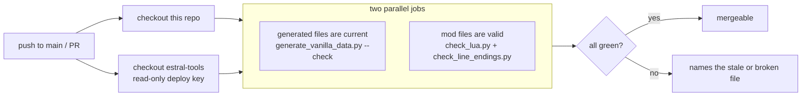

# Remove Vanilla Anything

[](https://github.com/mariaalexissales/Remove-Vanilla-Anything/actions/workflows/check.yml)
[](https://steamcommunity.com/sharedfiles/filedetails/?id=3799346338)

A Project Zomboid **Build 42** mod that strips vanilla content out of the loot tables and
vehicle spawn zones, category by category, from the sandbox settings — so a car pack, gun
pack or clothing pack has room to actually show up in the world.

Everything defaults to **off**. Installing the mod changes nothing until you turn a toggle on.

**[Get it on the Steam Workshop](https://steamcommunity.com/sharedfiles/filedetails/?id=3799346338)**

## What it removes

66 toggles across 8 sandbox pages. Each group has a master switch plus sub-categories in the
`Clothing - Shoes` style, so you can remove all clothing or just the footwear.

| Page | Toggles |
|---|---|
| Vehicles | master, Everyday Cars, Sports & Luxury, Police & Prison, Emergency & Service, Work & Delivery, Trailers, Burnt & Crashed, Traffic Jams, Junkyard, Story Vehicles |
| Clothing | master, Shoes, Pants, Shirts, Outerwear, Full Body, Headwear, Gloves, Underwear, Armor, Jewelry, Bags |
| Food & Drink | master, Perishable, Canned & Packaged, Drinks & Water Containers, Alcohol, Cookware, Seeds |
| Weapons | master, Firearms, Melee, Improvised & Crafted, Ammo, Weapon Parts, Explosives |
| Tools & Gear | master, Vehicle Maintenance, Camping, Fishing, Trapping, Gardening, Light Sources, Electronics, Radios & Communications |
| Medical & Literature | Medical master, Pills & Drugs, Bandages & Dressings; Literature master, Skill Books, Magazines & Recipes, Maps |
| Everything Else | Containers, Junk & Mementos, Crafting Materials, Furniture & Moveables, Animal Parts, Instruments, Sports Equipment, Household Items |
| General | Apply to corpse pocket loot, Also remove modded items, Log removals to console, and the two retroactive purges below |

## Modded content is never touched

Every removal is gated on a list of vanilla item and vehicle names **baked from the game's own
script files at build time**. A runtime `getModuleName() == "Base"` test would not do: plenty of
mods add items to `module Base`, and no B42 script object records which mod it came from.

There is an opt-in *Also remove modded items* switch for people who want a genuinely barren world.

## How it works

Three separate systems have to be handled, because vehicles reach the world by three routes.

**Loot** — `lua/server/RVA/RVA_Loot.lua` hooks `OnGameStart` and `OnServerStarted`. The sweep
visits six roots (`ProceduralDistributions.list`, `SuburbsDistributions`, `Distributions`,
`VehicleDistributions`, `ClutterTables`, `BagsAndContainers`), deduping by table identity —
dozens of those arrays are the same physical table reached by different paths — then calls
`IsoWorld.parseDistributions()` to rebuild the Java-side copy that container filling actually
reads.

`OnPostDistributionMerge` looks like the natural hook and is the wrong one. `IsoWorld.init()`
fires the three merge events at bytecode offsets 2051–2066 but does not read `map_sand.bin`
until offset 2126, where `SandboxOptions.load()` ends in `toLua()`. A handler on the merge
events sees the player's real settings on a *new game* — the new-game screen ran `toLua()`
beforehand — and nothing but declared defaults on every subsequent load of that same save.
`OnGameStart` runs from `IngameState`, after `IsoWorld.init()` returns, so both cases behave
identically. There is a regression test for this (`=== 2b.` in `test_mod.py`).

**Vehicle spawn zones** — `lua/server/RVA/RVA_Vehicles.lua` edits `VehicleZoneDistribution` on
`OnInitWorld`, then calls `VehicleType.Reset()`. `VehicleType` is exposed to Lua, lazy-initialises
(`if vehicles.isEmpty() init()`) and `Reset()` just clears the cache — so the edit can happen
after sandbox settings exist, with no load-order race against car pack mods. A zone left with no
vehicles is **deleted** rather than emptied: `getRandomVehicleType` returns null for a missing
zone and `IsoChunk` null-checks that, but an empty zone would hand Java a `VehicleType` with
nothing to pick from.

**Profession swaps and story wrecks** — `ProfessionVehicles.CheckSwap` rewrites a vehicle's
script on spawn based on map region, so its tables are filtered too, and any swap table hanging
off a vehicle that can no longer spawn is deleted outright. The Java randomised vehicle stories
place `*Smashed*` and `*Burnt*` scripts that appear in no Lua table at all, so there is also a
per-spawn `OnSpawnVehicleStart` check.

## What it does *not* do

The clothes a zombie **wears** come from `media/clothing/clothing.xml`, keyed by GUID, and are
not reachable from the loot tables — no amount of distribution surgery undresses a zombie.
What a zombie **carries** does live in `SuburbsDistributions.all.Outfit_*`, and that is what the
*Apply to corpse pocket loot* toggle governs.

## Enabling it mid-save

It works, but the two halves differ.

**Loot** takes effect immediately. `ItemPickerJava.Parse()` rebuilds from the Lua globals on every
load, and containers fill lazily on first open (`if not container:isExplored() then
ItemPicker.fillContainer(...)`, e.g. `ISOpenContainerTimedAction.lua:25-31`). Every container the
player has never opened — anywhere, however old the chunk — rolls from the stripped tables, as do
all future loot respawns. Only already-opened containers keep stale contents.

**Vehicles** barely change anything on an established save. `IsoChunk.doLoadGridsquare()` gates
`AddVehicles()` on `addZombies` (`isNewChunk()`) *and* `!VehiclesDB2.isChunkSeen(wx, wy)`, so
explored map keeps its vanilla cars permanently.

Hence `lua/server/RVA/RVA_Retro.lua` and its two opt-in toggles, both off by default because both
delete things that already exist:

- **`PurgeExistingVehicles`** — an `EveryOneMinute` pass over `getCell():getVehicles()` calling
  `permanentlyRemove()` on banned vanilla scripts. Occupied vehicles are skipped.
- **`PurgeExistingLoot`** — a `LoadGridsquare` handler that strips banned items from containers
  where `isExplored()` is already true. That event is hot enough that the engine ships
  `zombie.LoadGridsquarePerformanceWorkaround` to keep vanilla's own work off it, so the handler
  bails on its first line and memoises each chunk. It walks world objects only, so a character's
  inventory and worn bags are unreachable — which is also why it never calls `getPlayer()`, nil on
  a dedicated server.

Neither can damage a save: `ItemContainer.load` rebuilds items from their own serialised type and
`BaseVehicle.load` reads `scriptName` straight from the save, so nothing validates saved content
against the distribution tables. The mod removes zone entries, never vehicle scripts.

Two rough edges worth knowing:

- On an existing save the new options start at their declared defaults, and the main-menu screens
  are new-game-only. Changing them needs the debug sandbox window (`ISDebugMenu.lua:215-221`,
  gated on `getCore():getDebug()`), i.e. launching with `-debug`. That window's Apply never calls
  `toLua()`, so changes land on the next load.
- `SandboxOptions.save` writes only the options the live build knows about, so disabling the mod
  drops its stored values from `map_sand.bin` at the next save.

A new save is still the cleanest way to use it.

## Repository layout

```
Contents/mods/RemoveVanillaAnything/
  42/            mod.info, poster, icon
  common/media/  sandbox-options.txt, translations, lua
                 lua/server/RVA/  RVA_Loot.lua, RVA_Retro.lua, RVA_Vehicles.lua
                 lua/shared/RVA/  RVA_Config.lua, RVA_VanillaItems.lua, RVA_VanillaVehicles.lua
.github/         the CI workflows below
```

Five of those files are **generated** and carry a do-not-edit banner:

- `common/media/sandbox-options.txt`
- `common/media/lua/shared/Translate/EN/Sandbox.json`
- `common/media/lua/shared/RVA/RVA_Config.lua`
- `common/media/lua/shared/RVA/RVA_VanillaItems.lua`
- `common/media/lua/shared/RVA/RVA_VanillaVehicles.lua`

They come from a single hand-edited table, `categories.py`: add a category there, regenerate, and the
sandbox option, its translation, the runtime matcher and the baked vanilla lists all follow. The three
`RVA_*` Lua files and the two sandbox files are never edited directly.

## Tooling

The scripts live in a separate private repo, `estral-tools`, which every one of my mods shares. It is
cloned next to this folder and each script reads the mod out of the working directory:

| Script | What it does | Needs the game |
|---|---|---|
| `generate_vanilla_data.py` | Reads the game's own item and vehicle scripts and emits all five generated files | yes |
| `generate_vanilla_data.py --check` | Rebuilds the three files that come from `categories.py` alone and fails if any differ from disk | no |
| `test_mod.py` | Loads the real `Distributions.lua`, `ProceduralDistributions.lua`, `VehicleDistributions.lua`, `VehicleZoneDefinition.lua` and `ProfessionVehicles.lua` into a Lua VM behind a stub of the PZ API, fires the same events the game fires, and asserts on what came out | yes |
| `check_lua.py` | Every Lua file parses | no |
| `check_line_endings.py` | Nothing that ships has CRLF, and no file mixes the two | no |

After a Project Zomboid update, or after editing `categories.py`, from this folder:

```bash
py ../estral-tools/remove-vanilla-anything/generate_vanilla_data.py
py ../estral-tools/remove-vanilla-anything/test_mod.py
```

`test_mod.py` needs `lupa` (`py -m pip install lupa`). Both take the game install as an optional
argument and default to `F:\SteamLibrary\steamapps\common\ProjectZomboid`.

## How the CI works

Every push to `main` and every pull request runs [`check.yml`](.github/workflows/check.yml), which has
two parallel jobs, and [`pr-title.yml`](.github/workflows/pr-title.yml) on PRs.



**generated files are current.** Rebuilds `sandbox-options.txt`, `Sandbox.json` and `RVA_Config.lua`
from `categories.py` and compares them byte for byte with what is committed. It fails when someone
edited a generated file by hand, or changed `categories.py` and forgot to regenerate. The output names
the stale file.

**mod files are valid.** `check_lua.py` parses every Lua file, because the game only reports a syntax
error once it loads the file, and then skips the whole file. `check_line_endings.py` fails on CRLF
anywhere under `Contents/` or in `workshop.txt`: Project Zomboid checksums mod files on a multiplayer
join, and a CRLF copy can fail that check against a Linux server.

**pr title.** The title must start with `fix:`, `feat:`, `chore:`, `refactor:` or `docs:`. The title
reaches the script through an environment variable, never expanded into the shell line, so a crafted
title can't run as shell.

Dependabot keeps the pinned GitHub Actions current, weekly.

### How CI reaches a private repo

The scripts are in `estral-tools`, which is private, so the workflow checks it out into `./estral-tools`
using a **read-only deploy key** held in this repo's `ESTRAL_TOOLS_KEY` secret. Each mod's CI has its own
key (this one is `remove-vanilla-anything ci`), so any of them can be revoked without breaking the others.
Workflows run with `permissions: contents: read`, and `persist-credentials: false` keeps the token and key
out of the checkout's git config.

Pull requests from forks don't receive repository secrets, so the checks can't fetch the tooling for them
and will fail at the checkout step. That is a GitHub restriction, not a problem with the change. Open an
issue, or push a branch if you have access.

### What CI does not run

`test_mod.py`, the one that exercises the actual loot and vehicle logic, is **not** in CI. It loads the
game's own distribution files, which belong to Project Zomboid and can't be put on a runner. The same goes
for regenerating the two baked vanilla lists. Both run locally against a real install, before pushing, so a
green CI means the mod's files are well-formed and in sync with `categories.py`, not that the removal logic
was re-tested.

## More from Estral

- **[Pinoy Pantry](https://steamcommunity.com/sharedfiles/filedetails/?id=3791631305)**: sarap ng Pinas in Knox Country ([source](https://github.com/mariaalexissales/Pinoy-Pantry))
- **[Quest System Framework](https://steamcommunity.com/sharedfiles/filedetails/?id=3794717412)**: add quests to your multiplayer servers ([source](https://github.com/mariaalexissales/Quest-System-Framework))
- **[Player Leaderboard System](https://steamcommunity.com/sharedfiles/filedetails/?id=3795596462)**: have your players fight for first place, or keep track of your best lives in solo ([source](https://github.com/mariaalexissales/Leaderboard-Framework))
- **[Bundle Up! - A Packing Mod](https://steamcommunity.com/sharedfiles/filedetails/?id=3746632343)**: to organize all of your excessive stuff ([source](https://github.com/mariaalexissales/Bundle-Up))
- **[Dead Court Deck](https://steamcommunity.com/sharedfiles/filedetails/?id=3800241753)**: for your ~~scalper~~ collectable needs! ([source](https://github.com/mariaalexissales/Dead-Court-Deck))
- **[LAPLACE//DAEMON](https://steamcommunity.com/sharedfiles/filedetails/?id=3809376465)**: every blade you forge rolls a rarity, and a fortune ([source](https://github.com/mariaalexissales/LAPLACE-DAEMON))
